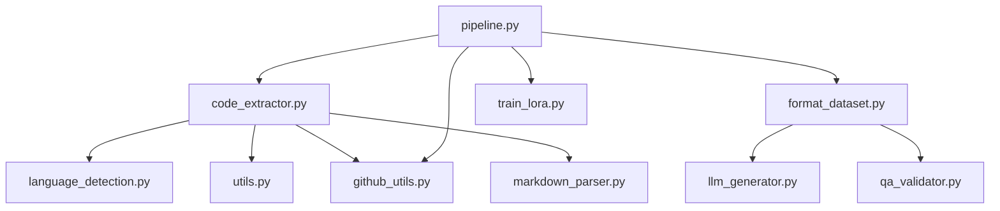

# DuaLipa Code Extractor - Module Relationships

## Core Module Dependencies

## Key Function Relationships

### code_extractor.py
- `extract_repository(repo_path, output_dir, extract_blocks)` → Main entry point
  - Calls → `detect_language()`
  - Calls → `_extract_files()`
  - Calls → `_extract_blocks()` (if extract_blocks=True)
    - Calls → `_extract_python_blocks()` (for Python)
    - Calls → `_extract_js_ts_blocks()` (for JS/TS)
    - Calls → `_extract_markdown_blocks()` (for Markdown)
    - Calls → `_extract_generic_blocks()` (fallback)

- `_extract_python_blocks(file_path, content, output_dir, stats)`
  - Tries → `_extract_with_tree_sitter()` first if available
  - Falls back to AST parsing
  - Requires:
    - `file_path`: Path object (not string)
    - `stats`: Dict with 'code_blocks', 'errors', 'file_blocks' keys

### github_utils.py
- `download_github_repo(repo_url, target_dir)` → Downloads a GitHub repository
  - Returns local repository path

### pipeline.py
- `run_pipeline(repo_path, output_dir, ...)` → Main orchestration function
  - Calls → `extract_repository()`
  - Calls → `format_for_lora()`
  - Calls → `train_lora()`
  - Calls → `merge_and_push_model()`

## Data Flow

1. **Input**: Repository path
2. **Stage 1** (github_utils.py): URL → Local repository files
3. **Stage 2** (code_extractor.py): 
   - Repository files → Filtered files by extension
   - Filtered files → Complete files with source info
   - Complete files → Logical blocks (functions, classes, markdown sections)
4. **Stage 3** (format_dataset.py):
   - Structured blocks → QA pairs
   - QA pairs → JSONL training dataset
5. **Stage 4** (train_lora.py):
   - JSONL dataset → LoRA adapter weights
6. **Output**: Model weights for improved code generation

## Critical Interdependencies

- `file_path` must be Path object for `_extract_*_blocks()` functions
- `stats` dictionary must contain 'code_blocks', 'errors', 'file_blocks' keys
- Tree-sitter is optional but preferred for extraction when available
- LLM generation requires proper API keys and services to be configured 