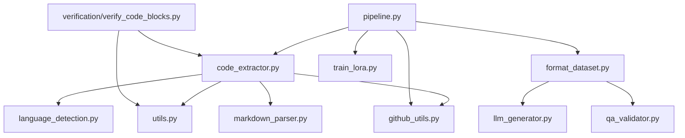

# DuaLipa Code Extractor - Module Relationships

## Core Module Dependencies



## Key Function Relationships

### code_extractor.py
- `extract_repository(repo_path, output_dir, extract_blocks)` → Main entry point
  - Calls → `detect_language()`
  - Calls → `_extract_files()`
  - Calls → `_extract_blocks()` (if extract_blocks=True)
    - Calls → `_extract_python_blocks()` (for Python)
    - Calls → `_extract_js_ts_blocks()` (for JS/TS)
    - Calls → `_extract_markdown_blocks()` (for Markdown)
    - Calls → `_extract_generic_blocks()` (fallback)

- `_extract_python_blocks(file_path, content, output_dir, stats)`
  - Tries → `_extract_with_tree_sitter()` first if available
  - Falls back to AST parsing
  - Implements script-level extraction for special files like `setup.py`
  - Requires:
    - `file_path`: Path object (not string)
    - `stats`: Dict with 'code_blocks', 'errors', 'file_blocks' keys

### verification/verify_code_blocks.py
- `verify_code_block(block, language)` → Verifies if a code block is valid
  - Wraps → `_verify_code_block()` from code_extractor.py
  - Provides a consistent interface for code verification

### github_utils.py
- `download_github_repo(repo_url, target_dir)` → Downloads a GitHub repository
  - Returns local repository path

### pipeline.py
- `run_pipeline(repo_path, output_dir, ...)` → Main orchestration function
  - Calls → `extract_repository()`
  - Calls → `format_for_lora()`
  - Calls → `train_lora()`
  - Calls → `merge_and_push_model()`

## Data Flow

1. **Input**: Repository path
2. **Stage 1** (github_utils.py): URL → Local repository files
3. **Stage 2** (code_extractor.py): 
   - Repository files → Filtered files by extension
   - Filtered files → Complete files with source info
   - Complete files → Logical blocks (functions, classes, markdown sections)
4. **Stage 3** (format_dataset.py):
   - Structured blocks → QA pairs
   - QA pairs → JSONL training dataset
5. **Stage 4** (train_lora.py):
   - JSONL dataset → LoRA adapter weights
6. **Output**: Model weights for improved code generation

## Critical Interdependencies

- `file_path` must be Path object for `_extract_*_blocks()` functions
- `stats` dictionary requirements vary by extraction function:
  - For most functions: 'code_blocks', 'errors', 'file_blocks' keys
  - For `_extract_markdown_blocks`: 'doc_blocks', 'code_blocks', 'errors', 'file_blocks' keys
- Functions now include defensive programming to initialize missing stats keys:
  ```python
  stats.setdefault("code_blocks", 0)  # For code extraction functions
  stats.setdefault("doc_blocks", 0)   # For markdown extraction
  ```
- Tree-sitter is optional but preferred for extraction when available
- LLM generation requires proper API keys and services to be configured

## Known Limitations

- **Nested Class Extraction**: Python's AST parser and Tree-sitter both flatten nested class structures.
  Classes defined inside other classes are extracted as separate top-level entities.
  This is due to how Python's object model works, where nested classes exist in the
  outer class's namespace but don't maintain a true parent-child relationship in the AST.

- **Verification Approach**: The verification module provides a standardized way to verify
  code blocks, but verification relies on language-specific strategies which may have 
  varying levels of strictness depending on the language and available parsers.

## Test and Implementation Relationships

The codebase follows a test-driven approach where tests serve as specifications of intended behavior. When tests fail, the implementation should be fixed rather than modifying tests to accommodate broken code.

### Key Testing Principles:

1. **Tests as Specifications**: Tests define expected behavior and should remain stable
2. **Fix Implementation, Not Tests**: When tests fail, fix the code they're testing
3. **Edge Cases Matter**: Tests for edge cases (like script files without functions) are important
4. **Counter Consistency**: Functions that modify counters (stats["code_blocks"]) must be consistent

### Example: Script-Level Extraction

The script-level extraction implementation demonstrates this principle:

- **Test**: `test_script_level_extraction()` verifies that files like `setup.py` (which don't contain traditional code blocks) are properly extracted as script blocks and counted in statistics
- **Implementation**: `_extract_python_blocks()` detects script files and extracts them correctly
- **Error Case**: If script blocks aren't counted in `stats["code_blocks"]`, tests will fail
- **Fix Approach**: Update implementation to count script blocks, not modify tests to ignore the counts

## Best Practices

1. **Implement Defensive Counters**: Always use `setdefault()` to initialize counters before incrementing
   ```python
   stats.setdefault("code_blocks", 0)
   stats["code_blocks"] += 1
   ```

2. **Preserve Test Intent**: Understand what a test is validating and preserve that intent

3. **Comprehensive Statistics**: Ensure all extraction methods correctly update statistics:
   - `stats["code_blocks"]` - For all code blocks including scripts
   - `stats["doc_blocks"]` - For documentation blocks
   - `stats["file_blocks"]` - For tracking blocks by file

4. **Script File Handling**: Special files (setup.py, webpack.config.js) should be extracted as complete scripts

5. **Consistent Error Handling**: Add errors to `stats["errors"]` with descriptive messages 