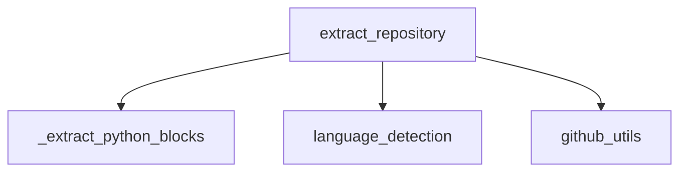

# DuaLipa TDD Development Workflow

This document provides explicit guidance for implementing and testing new functionality in the DuaLipa codebase using a structured Test-Driven Development (TDD) approach.

## ✅ Step-by-Step TDD Checklist

Follow these steps explicitly for each new feature or function you develop:

### 1️⃣ **Configure Pytest Environment**

First, ensure proper pytest configuration in `pytest.ini`:

```ini
[pytest]
testpaths = tests
addopts = -p no:xdist
asyncio_mode = strict
asyncio_default_fixture_loop_scope = function

# Filter warnings
filterwarnings =
    # Ignore tree-sitter Language deprecation warning
    ignore:Language\(path, name\) is deprecated:FutureWarning
    # Ignore event_loop fixture redefinition warning
    ignore:The event_loop fixture provided by pytest-asyncio has been redefined:DeprecationWarning
```

**Critical Requirements**:
- Set `asyncio_mode = strict` for proper async test handling
- Configure `asyncio_default_fixture_loop_scope = function` to avoid warnings
- Filter known warnings that can't be fixed (e.g., from dependencies)
- Document any filtered warnings with explanations

### 2️⃣ **Define the Function Interface Clearly**

- Reference existing documentation from [`function_reference.md`](src/agent_tools/dualipa/docs/function_reference.md).
- Example for `_extract_python_blocks`:

```python
def _extract_python_blocks(
    file_path: Path,              # MUST be Path object, not string
    content: str,                 # Content of the file
    output_dir: Path,             # Output directory (Path object)
    stats: Dict[str, Any]         # MUST contain keys: "code_blocks", "errors", "file_blocks"
) -> int:                         # Returns number of blocks extracted
```

**Critical Requirements**:
- Ensure `file_path` is always a `Path` object.
- Initialize `stats` defensively using `setdefault()`:
```python
stats.setdefault("code_blocks", 0)
stats.setdefault("errors", [])
stats.setdefault("file_blocks", {})
```

### 3️⃣ **Write the Pytest FIRST (Before Implementation)**

- Write explicit pytest functions that clearly define expected behavior.
- Example test (`tests/dualipa/extraction/grok/test_03_python_ast_extraction.py`):

```python
def test_extract_python_blocks(temp_dir):
    """Test Python block extraction from a simple file."""
    code = """
def test_func():
    return "Hello"
class TestClass:
    def method(self):
        pass
"""
    file_path = temp_dir / "test.py"
    with open(file_path, "w") as f:
        f.write(code)

    stats = initialize_stats_dict()
    num_blocks = _extract_python_blocks(file_path, code, temp_dir, stats)

    assert num_blocks == 2, f"Expected 2 blocks, got {num_blocks}"
    assert stats["code_blocks"] == 2, "Stats not updated correctly"
    blocks_dir = temp_dir / "blocks" / "code" / "python"
    assert blocks_dir.exists(), "Blocks directory not created"
    assert len(list(blocks_dir.glob("*.py"))) == 2, "Block files not created"
```

**Critical Testing Principles**:
- Tests define expected behaviors clearly.
- Tests fail initially (Red), then you implement code to pass them (Green).

### 4️⃣ **Run Pytest Immediately After Writing the Test**

- Ensure the test fails initially to confirm it's valid:
```bash
pytest tests/dualipa/extraction/grok/test_03_python_ast_extraction.py::test_extract_python_blocks
```

### 5️⃣ **Implement Minimal Code to Pass the Test**

- Implement the function according to documented requirements.
- Continuously run pytest after each incremental change until it passes.

### 6️⃣ **Analyze Test Failures Explicitly**

If pytest fails:

1. Identify exactly which assertion failed.
2. Clearly state expected vs actual results.
3. Locate problematic implementation lines causing failure.
4. Fix implementation (never modify tests to accommodate failing implementations).

Example structured analysis prompt for agent:

> **Pytest failed!**
> - Assertion failed: `assert num_blocks == 2`
> - Expected: `2`, Actual: `1`
> - Problematic line in implementation: `_extract_python_blocks()` did not count script-level block correctly.
> - Proposed fix: Ensure script-level blocks increment `stats["code_blocks"]`.

### 7️⃣ **Handle Test Warnings Properly**

When encountering test warnings:

1. **Analyze Warning Type**:
   - Is it from our code? Fix the underlying issue
   - Is it from a dependency? Document and filter if necessary

2. **Warning Categories**:
   - `DeprecationWarning`: Update to newer APIs when possible
   - `FutureWarning`: Plan for future updates
   - `RuntimeWarning`: Investigate potential issues
   - `UserWarning`: Document expected behavior

3. **Filtering Guidelines**:
   - Only filter warnings that:
     - Come from third-party dependencies
     - Cannot be fixed in our codebase
     - Are documented with clear explanations
   - Never filter warnings from our own code

4. **Document Filtered Warnings**:
   ```python
   # In pytest.ini:
   filterwarnings =
       # Explain WHY this warning is filtered
       ignore:specific warning text:WarningCategory
   ```

### 8️⃣ **Refactor After Passing Tests**

- After tests pass (Green), refactor your implementation for clarity and maintainability.
- Confirm all tests remain passing after refactoring.

---

## ✅ **Integration with Existing Documentation**

Explicitly reference existing documentation and module relationships from [`module_relationships.md`](src/agent_tools/dualipa/docs/module_relationships.md):



This ensures your implementation aligns with existing architecture.

---

## ✅ **Defensive Programming Best Practices**

Always follow defensive programming patterns explicitly mentioned in documentation:

- Initialize dictionary keys defensively:
```python
stats.setdefault("code_blocks", 0)
stats["code_blocks"] += 1
```

- Validate inputs explicitly before processing:
```python
if not isinstance(file_path, Path):
    raise TypeError("file_path must be a Path object")
```

---

## ✅ **Stats Dictionary Consistency Checks**

Explicitly verify stats dictionary consistency after each extraction:

```python
assert isinstance(stats["languages"], dict), "Languages must be a dictionary"
assert stats["code_blocks"] >= 0, "Code blocks counter must be non-negative"
assert isinstance(stats["errors"], list), "Errors must be a list"
```

---

## ✅ **Script-Level Extraction Handling**

Special files (`setup.py`, `manage.py`, etc.) must be explicitly handled as script-level blocks. Include explicit tests for these cases:

```python
def test_script_level_extraction(temp_dir):
    """Test extraction of script-level Python files."""
    script_code = 'print("Hello World")'
    file_path = temp_dir / "setup.py"
    with open(file_path, "w") as f:
        f.write(script_code)

    stats = initialize_stats_dict()
    num_blocks = _extract_python_blocks(file_path, script_code, temp_dir, stats)

    assert num_blocks == 1, "Script-level block not extracted"
    assert stats["code_blocks"] == 1, "Stats not updated for script block"
```

---

## ✅ **Error Handling & Logging**

Explicitly capture errors and log them clearly in `stats["errors"]`:

```python
try:
    # extraction logic here...
except Exception as e:
    stats["errors"].append(str(e))
```

---

## ✅ **Markdown Document Updates & Task Completion**

After completing each task step:

- Explicitly update documentation/comments clearly explaining logic and edge cases handled.
- Mark tasks complete only after passing pytest and verifying documentation updates.

---

## Test Documentation Pattern

### Test File Structure

Every test file should follow this structure:

```python
"""
TEST EXPECTATIONS

1. test_name_one:
   Input: <brief description>
   Expected Output:
   {
       # Complete expected output structure
       # with comments explaining critical values
   }

2. test_name_two:
   Input: <brief description>
   Expected Output:
   {
       # Complete expected output structure
       # with comments explaining critical values
   }

CRITICAL RULES:
1. Rule Category One:
   - Specific rule details
   - Edge cases to consider
   - Common pitfalls

2. Rule Category Two:
   - Specific rule details
   - Edge cases to consider
   - Common pitfalls

Input:
- parameter_one: type and description
- parameter_two: type and description

Output Structure:
{
    # Complete output structure template
    # with type information and descriptions
}

<Test purpose and pipeline stage description>
"""

# Test implementation follows...
```

### Key Components

1. **Test Expectations**:
   - Must be at the top of the file
   - Show complete input/output examples
   - Include comments explaining critical values
   - Use realistic data that matches production

2. **Critical Rules**:
   - Document counting rules if applicable
   - Specify handling of edge cases
   - Define validation rules
   - List common pitfalls

3. **Input/Output Structure**:
   - Define all parameters
   - Show complete output structure
   - Include type information
   - Document optional fields

4. **Implementation Guidelines**:
   - Tests should verify against documented expectations
   - Assert messages should reference expectations
   - Variable names should match documentation
   - Comments should link to relevant rules

### Benefits

1. **Prevents Implementation Drift**:
   - Clear source of truth
   - Easy to verify correct behavior
   - Prevents accidental test modifications

2. **Improves Debugging**:
   - Quick comparison of actual vs expected
   - Clear understanding of requirements
   - Easy to identify rule violations

3. **Enhances Maintainability**:
   - New developers can understand quickly
   - Changes can be verified against rules
   - Documentation stays in sync with code

4. **Facilitates TDD**:
   - Write expectations before implementation
   - Clear criteria for "done"
   - Easy to verify all cases covered

By following this explicitly customized Markdown workflow—directly referencing your provided DuaLipa docs and tests—you significantly reduce ambiguity for your LLM agent. The agent will remain tightly aligned with your intended TDD workflow and produce robust, well-tested implementations.

